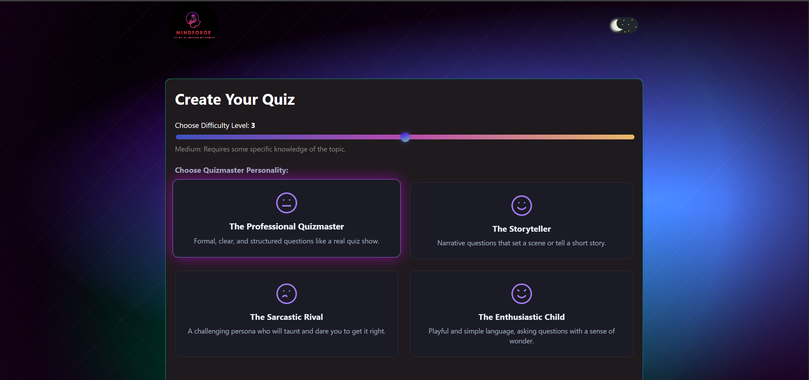
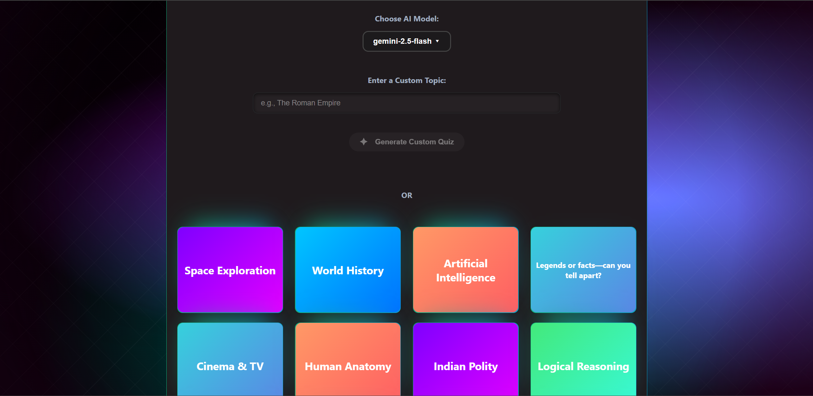
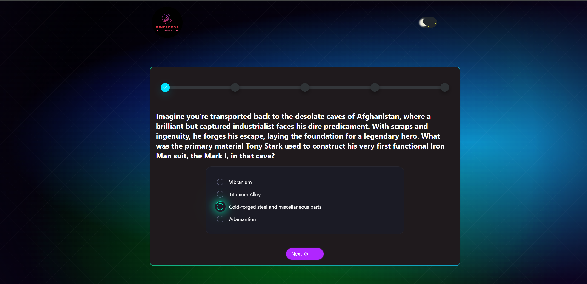
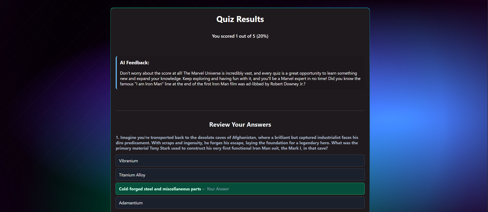
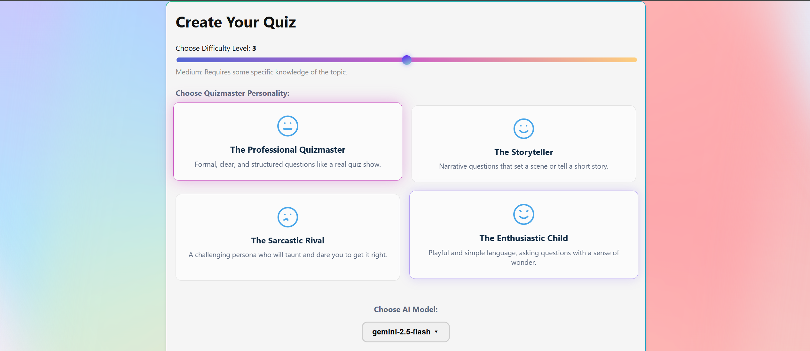
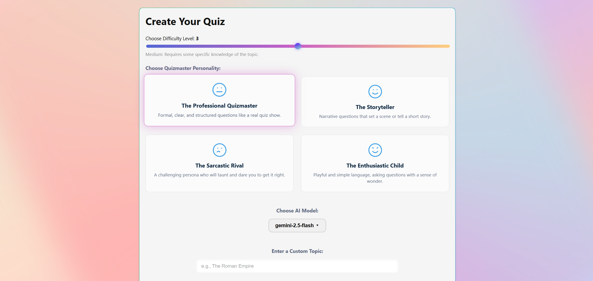
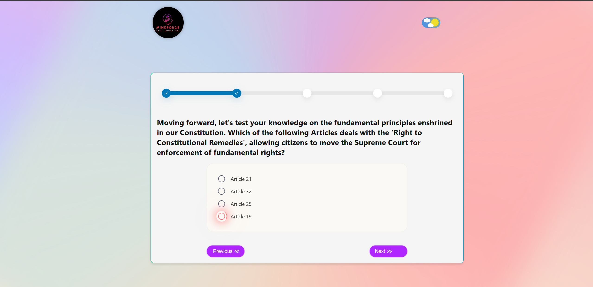
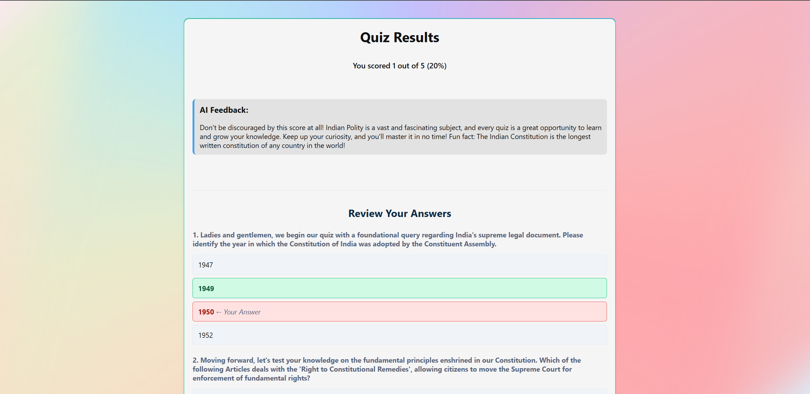
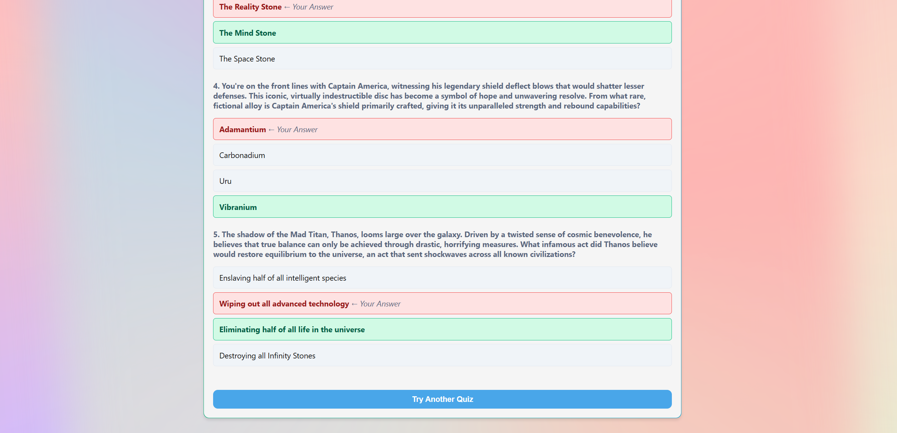

<div align="center">
  <br />
  <h1>Mindforge</h1>
  <strong>Created by AI, defeated by humans?</strong>
  <br />
  <br />
</div>

> An advanced, front-end quiz application that uses the power of generative AI to create unique, personalized quizzes on demand. Go beyond simple trivia by defining the quiz topic, difficulty, and even the AI Quizmaster's personality!

<br />

---

<br />

<div align="center">
  
  
  
  
</div>

<br />

---

### Live Demo & Preview

<div align="center">

*A quick look at the quiz creation process and gameplay.*


<video controls loop muted playsinline width="800">
  <source src="./public/PLumQuiz.mp4" type="video/mp4">
  Your browser does not support the video tag. <a href="./public/PLumQuiz.mp4">Download</a>.
</video>

</div>

---


### Deployed Site

The app is live at: **https://mindforgeaiquiz.vercel.app/**

---


### About MindForge - An AI based Quiz App

**Mindforge** isn't just another trivia app—it's a dynamic arena where human intellect clashes with the creative power of artificial intelligence. Our slogan, *"Created by AI, defeated by humans?"*, captures the essence of our platform: to provide a limitless, ever-changing challenge that moves beyond static, predictable quizzes. We believe the true test of knowledge lies in tackling questions you've never seen before, crafted in real-time by a formidable AI opponent.

Mindforge is built around the concept of the **"Quiz Recipe,"** giving you complete control to architect your perfect trivia challenge.

---

### 🧩 The Ultimate "Quiz Recipe" Builder

At the heart of Mindforge is a powerful customization engine. You don't just play a quiz; you create it.

-   **Craft Your Topic:**
    -   **Custom Generation:** Unleash your curiosity by typing in any topic imaginable. From "18th-Century Naval Warfare" to "The Lore of The Lord of the Rings," the AI will generate a unique quiz just for you.
    -   **Curated Topic Cards:** Don't know what to ask? Browse through a beautiful gallery of predefined topic cards to get started instantly.

-   **Dial in the Difficulty:**
    -   Take control of the challenge with a **5-point difficulty slider**. Each level adjusts the complexity of the questions, from fun, surface-level facts to expert-grade trivia that will test the most knowledgeable enthusiast.

-   **Choose Your Quizmaster:**
    -   This isn't just a quiz; it's a conversation. Select from a variety of **AI Quizmaster Personalities**—like "The Storyteller," "The Sarcastic Rival," or "The Professional Quizmaster"—each with a unique tone and style that completely changes the feel of the quiz.

-   **Select Your AI Engine:**
    -   Peek under the hood and choose from different powerful **generative AI models**. See for yourself how different AI brains craft unique questions and challenges.

### A Polished & Robust User Experience

Beyond the AI, Mindforge is designed to be a beautiful and resilient application.

-   **Immersive Theming:**
    -   **Light & Dark Modes:** A sleek, toggleable theme system that saves your preference and can detect your system's default settings.
    -   **"Glassmorphism" UI:** A modern and visually stunning interface featuring frosted-glass effects and vibrant glows that adapt to the selected theme.

-   **Instant Learning Loop:**
    -   **Real-Time AI Feedback:** Upon completion, receive a custom-generated feedback message from the AI based on your score.
    -   **Detailed Answer Review:** Don't just see your score; learn from your mistakes. The results screen provides a comprehensive breakdown of every question, showing your answer alongside the correct one.

-   **Seamless & Resilient:**
    -   **Smooth Navigation:** The app features a fluid user experience with a splash screen, clean transitions, and full navigational control (including a "Previous" button).
    -   **Graceful Error Handling:** A dedicated error screen and a "self-defending" AI prompt ensure that API failures or bad user input won't crash the app, providing a smooth experience even when things go wrong.

<br />


### Key Features

* **The "Quiz Recipe" Builder:** Don't just pick a topic, craft a unique quiz experience!

  * **Infinite Topics:** Generate a quiz on any subject you can imagine.
  * **5-Point Difficulty Scale:** Fine-tune the challenge from "Easiest" to "Expert-Level."
  * **Quizmaster Personalities:** Choose an AI persona (like "The Storyteller" or "The Sarcastic Rival") to change the tone and style of the questions.
* **Multi-Model Support:** Select from different powerful generative AI models to create your quiz.
* **Sleek Light & Dark Modes:** A beautiful, modern UI with a theme that respects your system preferences and saves your choice in local storage.
* **Instant Answer Review:** After the quiz, get a detailed breakdown of your answers versus the correct ones.
* **Fully Responsive Design:** A seamless experience on both desktop and mobile devices.

---

### Getting Started

Follow these instructions to get the project running on your local machine for development and testing purposes.

#### 1. Prerequisites

* Node.js (v18 or higher recommended)
* npm or a compatible package manager

#### 2. Installation & Setup

1. **Clone the Repository:**

   ```bash
   git clone https://github.com/ShaanKapoor10/Plum-Quiz-App.git
   ```

2. **Install Dependencies:**

   ```bash
   npm install
   ```

3. **Set Up Environment Variables:**
   This project requires an API key from Google to use the Gemini models.

   * Go to [Google AI Studio](https://aistudio.google.com/app/apikey) to create an API key.
   * In the root of your project, create a new file named `.env`.
   * Add your key to this file:

     ```env
     VITE_GEMINI_API_KEY="YOUR_API_KEY_HERE"
     ```

4. **Run the Development Server:**

   ```bash
   npm run dev
   ```

   Open [http://localhost:5173](http://localhost:5173) to view it in the browser.

---

### Architecture & State Management Choices

This is a **front-end only application** architected for simplicity, maintainability, and a great developer experience.

External AI API (Google Gemini)

* **Component-Based UI:** The UI is built with **React** and **TypeScript**, with a clear separation between reusable `components` (like buttons and cards) and `screens` (full-page views).

* **Centralized State Management:** We chose **React Context API** (`QuizContext`) to manage the global application state. For an app of this scale, it provides a powerful and lightweight solution without the boilerplate of larger libraries like Redux. The `QuizContext` is the "single source of truth" for the game's state, including the current screen, quiz questions, user answers, and theme settings.

* **Styling:** The UI is styled using **CSS Custom Properties (Variables)**, allowing for a robust and easily maintainable light/dark theming system. All component-specific styles are co-located in `App.css`, while the theme palette is defined globally in `index.css`.

* **Service Abstraction:** All external API calls are handled in a dedicated "service" file (`aiService.ts`). This isolates our data-fetching logic, making it easy to modify or even swap out the AI provider without touching the UI components.

---

### Prompt Engineering: The Art of the Prompt

A key part of this project was refining the prompt sent to the AI to ensure consistent, reliable, and high-quality JSON output. This section details the journey of our prompt from a simple request to a robust, "self-defending" set of instructions.

#### The Journey

1. **V1 : Initial Prompt:** We started with a simple instruction like `"Generate 5 quiz questions about [Topic]."`, which was unreliable and produced inconsistent formatting.

    **Why it changed**: This was highly unreliable. The AI's response was unstructured text that varied wildly between calls, making it impossible for our application to parse and display consistently.

2. **V2 : Enforcing JSON Structure** We then moved to a more structured prompt that defined the required JSON schema, but it still struggled with edge cases.
   This was the first major leap. We explicitly instructed the AI to act as a JSON provider and defined the exact schema we needed.


    ```
    You are a helpful quiz-generating assistant. Your task is to generate a quiz based on a given topic.
    Respond ONLY with a valid JSON object. Do not include any introductory text, explanations, or code block formatting like "\`\`\`"json.

    The JSON object should represent a quiz and have a single key "questions" which is an array of 5 question objects.

    Each question object must have the following keys:

    - "question": A string containing the question text.

    - "options": An array of 4 unique strings representing the multiple-choice options.

    - "correctAnswerIndex": A number (0, 1, 2, or 3) representing the index of the correct answer in the "options" array.

    Topic: "${topic}"`
    ```

    **Why it changed**: This solved the consistency problem. By demanding a strict JSON format, we transformed the AI from a simple text generator into a predictable, machine-readable data source for our application.

3. **V3 : Adding Quiz Parameters (Difficulty)** As we added the "Difficulty" feature, the prompt needed to accept more parameters. We introduced a "specifications" block to make these constraints clear to the AI.


    ````
    You are a helpful quiz-generating assistant. Your task is to generate a quiz based on a given topic and difficulty level.
    Respond ONLY with a valid JSON object. Do not include any introductory text, explanations, or code block formatting like \````json.

    --- QUIZ SPECIFICATIONS ---
    - Topic: "${topic}"
    - Difficulty Level: ${difficulty} out of 5.
    - Difficulty Description: ${difficultyDescription}
    --- END SPECIFICATIONS ---
    The JSON object must have a single key "questions" which is an array of 5` question objects.
    Each question object must have the following keys:
    - "question": A string containing the question text.
    - "options": An array of 4 unique strings representing the multiple-choice options.
    - "correctAnswerIndex": A number (0, 1, 2, or 3) representing the index of the correct answer in the "options" array. 
    ````

     **Why it changed**: This made our prompt dynamic and modular. We could now pass a "recipe" of options to the AI, allowing for more user customization. The structured block helps the AI focus on all the required constraints.

4. **V4 : Introducing Quizmaster Personalities** :
   To make the quiz more engaging, we added the concept of AI personas. The prompt was updated to command the AI to adopt a specific personality.

     **Why it changed**: This elevated the prompt from a simple data request to a creative directive. It instructs the AI not just on what to generate, but how to generate it, fundamentally changing the user experience based on their choice.

5. **The Self-Defending Master Prompt** :

    The final prompt is a comprehensive set of instructions that treats the AI like a formal API. It includes:
    - **A "Self-Defending" Clause:** It instructs the AI on how to handle bad user input (e.g., a nonsensical topic) by returning a specific JSON error object, which the application can then handle gracefully.
    - **Detailed Persona Instructions:** It provides a "Personality Directive," telling the AI which persona to adopt and giving concrete examples of how that persona should influence the question style.
    - **Complete Specifications:** It passes the full "quiz recipe" (topic, difficulty, etc.) in a structured block, ensuring all constraints are met.


    ````
    You are a robust JSON-generating API. Your primary function is to create educational quizzes.
    The user-provided topic is: "${topic}"

    --- PRE-GENERATION CHECK ---
    First, evaluate the topic. If the topic is nonsensical (e.g., "asdfghjk"), ambiguous, inappropriate, or too short (less than 3 characters) to generate a meaningful quiz, you MUST respond with the following JSON object and nothing else:
    {
    "error": "The topic you provided is invalid or too vague. Please provide a more specific and appropriate topic."
    }
    --- END PRE-GENERATION CHECK ---

    If the topic is valid, proceed with generating the quiz according to the specifications below.

    You are a helpful quiz-generating assistant and
    You are an AI Quizmaster. You MUST adopt the following personality for the entire duration of this quiz generation task.

    --- PERSONALITY DIRECTIVE ---
    ${personalityInstruction}
    --- END DIRECTIVE ---

    Your task is to generate a quiz based on the user's specifications. Your adopted personality should influence the TONE, STYLE, and CONTEXT of the questions you create.

    --- QUIZ SPECIFICATIONS ---
    - Topic: "${topic}"
    - Difficulty Level: ${difficulty} out of 5 (${difficultyDescription})
    --- END SPECIFICATIONS ---

    Now, generate the quiz. 
    Respond ONLY with a valid JSON object. Do not include any introductory text, explanations, or code block formatting like \`\`\`json.

    The JSON object must have a single key "questions" which is an array of 5 question objects.
    Each question object must have the following keys:
    - "question": A string containing the question text, phrased according to your assigned personality.
    - "options": An array of 4 unique strings.
    - "correctAnswerIndex": A number between 0 and 3.
    ````

This sophisticated prompt is the engine that drives the app's unique and customizable experience.


---

### 📸 Screenshots

📸 Screenshots
A glimpse into the "Quiz Recipe" builder and the core gameplay experience, available in both a sleek dark mode and a clean light mode.


|  | Topic Screen | Quiz Screen | Result Screen |
| :---: | :---: | :---: | :---: |
| **Dark** | <br/> |  |  |
| **Light** | <br/> |  | <br/> |

---


### Known Issues & Future Roadmap

* **Known Issue: API Key Exposure**
  As a purely client-side application, the Google API key is exposed in the browser's network requests. For a production-level application intended for public use, this is a significant security risk. **The next step would be to refactor all API calls into a secure backend (e.g., using serverless functions on Vercel or Netlify).**

* **Future Roadmap**

  * **Secure Backend:** Implement the backend refactor mentioned above to protect API keys.
  * **Multiplayer Mode:** Add a "hot-seat" multiplayer mode where users can take turns on the same device.
  * **More "Recipe" Options:** Allow users to select the number of questions, different question formats (True/False), or add time limits.
  * **API Call Retries:** Implement a simple retry mechanism in `aiService.ts` to make the app more resilient to temporary network failures.

---
